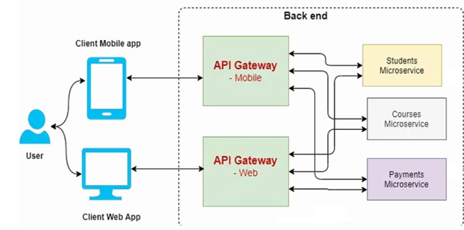
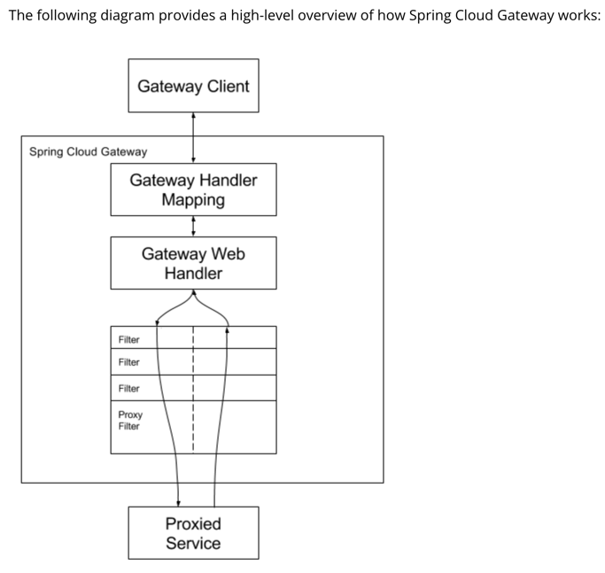
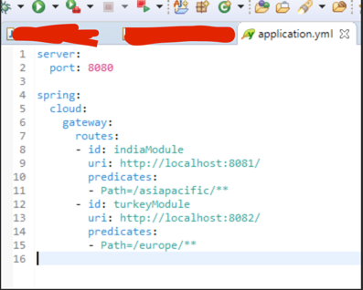

# API Gateway using Spring-Cloud-Gateway

## Why do Microservices need API Gateway

* An API gateway is a software application between a client and a set of backend microservices. 
* The API Gateway serves as a reverse proxy to accept API calls from the client application, forwarding this traffic to the appropriate service.
* The gateway provides a single endpoint or URL for the client apps and then internally maps the requests to a group of internal microservices.

## Netflix ZUUL vs Spring-Cloud-Gateway
* Zuul is a <b>blocking API</b>. - A blocking gateway api makes use of as many threads as the number of incoming requests. 
So this approach is more resource intensive. If no threads are available to process incoming request then the request has to wait in queue. 
* Spring Cloud Gateway is a <b>non blocking API</b>. - When using non blocking API, a thread is always available to process the incoming request.  These request are then processed asynchronously in the background 
and once completed the response is returned. So no incoming request never gets blocked when using Spring Cloud Gateway.

## Spring-cloud-gateway
* An API Gateway acts as a single entry point for a collection of microservices. 
* Any external client cannot access the microservices directly but can access them only through the application gateway 
* In a real world scenario an external client can be any one of the three- 
     * Mobile Application 
     * Desktop Application 
     * External Services or third party Apps 
    
#### Note: 
* To include Spring Cloud Gateway in your project, use the starter with a group ID of <b>org.springframework.cloud</b> and an artifact ID of <b>spring-cloud-starter-gateway</b>. 
* If you include the starter, but you do not want the gateway to be enabled, set <b>spring.cloud.gateway.enabled=false</b>.
* Spring Cloud Gateway is built on <b>Spring Boot 2.x, Spring WebFlux, and Project Reactor</b>.
* Spring Cloud Gateway requires the Netty runtime provided by Spring Boot and Spring Webflux. It does not work in a traditional Servlet Container or when built as a WAR.

## Spring Cloud Gateway Architecture

Spring Cloud Gateway is API Gateway implementation by Spring Cloud team on top of Spring reactive ecosystem.  

* It consists of the following building blocks::  
-<b>Route</b>: Route the basic building block of the gateway. It consists of : 
      * ID  
      * Destination URI  
      * Collection of predicates and a collection of filters  
* A route is matched if aggregate predicate is true. 
* <b>Predicate</b>: This is similar to Java 8 Function Predicate. Using this functionality we can match HTTP request, such as headers , url, cookies or parameters. 
* <b>Filter</b>: These are instances Spring Framework GatewayFilter. Using this we can modify the request or response as per the requirement. 

<b>A simpified diagram provided by Spring Cloud Gateway official website :</b>

When the client makes a request to the Spring Cloud Gateway, the Gateway Handler Mapping first checks if the request matches a route. 
This matching is done using the predicates. 
If it matches the predicate then the request is sent to the filters. 
* <b>PreFilter</b> = Decides which downstream microservice needs to be called (i.e Service 1 or Service 2), it also modifies the request if required. 
* <b>PostFilter</b> = Post filter will be called once response needs to be send to a calling consumer, it also modifies the response if required. 

## Sample API Gateway Routing application.yml

## References:

* https://cloud.spring.io/spring-cloud-gateway/reference/html/#gateway-how-it-works
* https://konghq.com/learning-center/api-gateway/what-is-an-api-gateway
* https://blog.knoldus.com/differences-netflix-zuul-and-spring-cloud-gateway/

